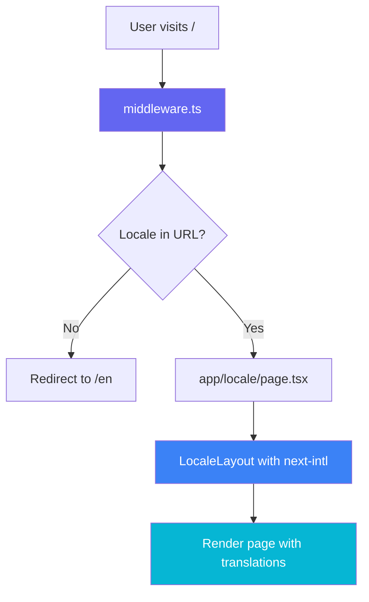

# Vercel Deployment Preparation Plan

## Project Overview
SpacePortfolio — Next.js 14.2 portfolio site with `next-intl` v4 i18n, Three.js star background, Framer Motion animations, and Tailwind CSS.

---

## Issues Found

### 🔴 Critical — Will Cause Build Failure

#### 1. Missing `maath` dependency
- **File:** [`StarBackground.tsx`](components/main/StarBackground.tsx:7)
- **Problem:** Imports `maath/random/dist/maath-random.esm` but `maath` is NOT listed in [`package.json`](package.json)
- **Fix:** Add `maath` to `dependencies`

#### 2. Runtime packages in devDependencies
- **File:** [`package.json`](package.json)
- **Problem:** Vercel runs `npm install --omit=dev` in production, so `devDependencies` are NOT installed. The following packages are used at runtime but listed as devDependencies:
  - `framer-motion` — used in 6+ components
  - `react-intersection-observer` — used in 5+ components
  - `three` — used by StarBackground
  - `@react-three/fiber` — used by StarBackground
  - `@react-three/drei` — used by StarBackground
- **Fix:** Move all 5 packages from `devDependencies` to `dependencies`

#### 3. Middleware not using next-intl createMiddleware
- **File:** [`middleware.ts`](middleware.ts)
- **Problem:** Custom middleware implementation instead of using `createMiddleware` from `next-intl/middleware`. The dev.log shows `Couldn't find next-intl config file` errors. With `next-intl` v4, the middleware must use the official API.
- **Fix:** Replace custom middleware with `createMiddleware` from `next-intl/middleware` using the routing config from [`i18n/routing.ts`](i18n/routing.ts)

### 🟡 Important — Should Fix

#### 4. Typo in StarBackground.tsx
- **File:** [`StarBackground.tsx`](components/main/StarBackground.tsx:34)
- **Problem:** `dethWrite` should be `depthWrite` — this is a Three.js prop name typo
- **Fix:** Change `dethWrite` to `depthWrite`

#### 5. Missing generateStaticParams
- **Files:** [`app/[locale]/page.tsx`](app/[locale]/page.tsx) and [`app/[locale]/layout.tsx`](app/[locale]/layout.tsx)
- **Problem:** Without `generateStaticParams`, Vercel cannot pre-render locale pages at build time. This can cause 500 errors or slow cold starts.
- **Fix:** Export `generateStaticParams` returning `[{locale: 'en'}, {locale: 'ru'}, {locale: 'uz'}]`

#### 6. Unnecessary files bloating the deployment
- **Files:** [`dev.log`](dev.log), [`app/luxx.png`](app/luxx.png), [`app/Акбар_Маманазаров_CV_.docx`](app/Акбар_Маманазаров_CV_.docx), [`public/Акбар_Маманазаров_CV_.docx`](public/Акбар_Маманазаров_CV_.docx)
- **Problem:** Log files, duplicate images, and CV files add bloat. Non-ASCII filenames can also cause issues on some systems.
- **Fix:** Delete these files and add patterns to `.gitignore`

#### 7. .gitignore missing entries
- **File:** [`.gitignore`](.gitignore)
- **Problem:** Missing `dev.log`, `*.log`, and other common entries
- **Fix:** Add `*.log` and other missing patterns

---

## Step-by-Step Implementation

### Step 1: Fix package.json dependencies
Move runtime packages from `devDependencies` to `dependencies` and add `maath`:

```json
{
  "dependencies": {
    "next": "14.2",
    "next-intl": "^4.9.1",
    "react": "^18.3.1",
    "react-dom": "^18.3.1",
    "react-icons": "^4.12.0",
    "framer-motion": "^10.16.14",
    "react-intersection-observer": "^9.5.3",
    "three": "^0.159.0",
    "@react-three/fiber": "^8.15.12",
    "@react-three/drei": "^9.90.0",
    "maath": "^0.10.7"
  },
  "devDependencies": {
    "@types/node": "^20",
    "@types/react": "^18",
    "@types/react-dom": "^18",
    "@types/three": "^0.159.0",
    "autoprefixer": "^10.0.1",
    "eslint": "^8",
    "eslint-config-next": "14.0.3",
    "postcss": "^8",
    "tailwindcss": "^3.3.0",
    "typescript": "^5"
  }
}
```

> Note: `@types/three` should be added to devDependencies for TypeScript support.

### Step 2: Fix middleware.ts
Replace custom middleware with next-intl official middleware:

```typescript
import createMiddleware from 'next-intl/middleware';
import { routing } from './i18n/routing';

export default createMiddleware(routing);

export const config = {
  matcher: ['/', '/(en|ru|uz)/:path*']
};
```

### Step 3: Fix StarBackground.tsx typo
Change `dethWrite` → `depthWrite` on line 34.

### Step 4: Add generateStaticParams
Add to both [`app/[locale]/layout.tsx`](app/[locale]/layout.tsx) and [`app/[locale]/page.tsx`](app/[locale]/page.tsx):

```typescript
export function generateStaticParams() {
  return [{ locale: 'en' }, { locale: 'ru' }, { locale: 'uz' }];
}
```

### Step 5: Clean up unnecessary files
- Delete `dev.log`
- Delete `app/luxx.png` — duplicate of `public/luxx.png`
- Delete `app/Акбар_Маманазаров_CV_.docx`
- Delete `public/Акбар_Маманазаров_CV_.docx`

### Step 6: Update .gitignore
Add missing entries:
```
*.log
app/luxx.png
```

### Step 7: Run npm install and test build
```bash
rm -rf node_modules package-lock.json
npm install
npm run build
```

---

## Architecture Flow



## Deployment Checklist
- [ ] All dependencies correctly listed in package.json
- [ ] Middleware uses next-intl createMiddleware
- [ ] generateStaticParams exported for locale pages
- [ ] No TypeScript errors
- [ ] `npm run build` succeeds locally
- [ ] No unnecessary files in the repo
- [ ] Push to GitHub and connect to Vercel
- [ ] Set Node.js version to 18.x in Vercel project settings
